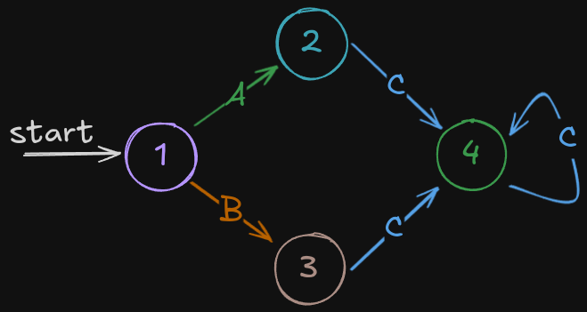

# Finite State Machine Project

This project implements a Finite State Machine

The language for this DFA is: (a+b)c\*

Some examples of acceptable input are: ac, bc, acc, bcc, accc, bccc, etc.

Layout:

