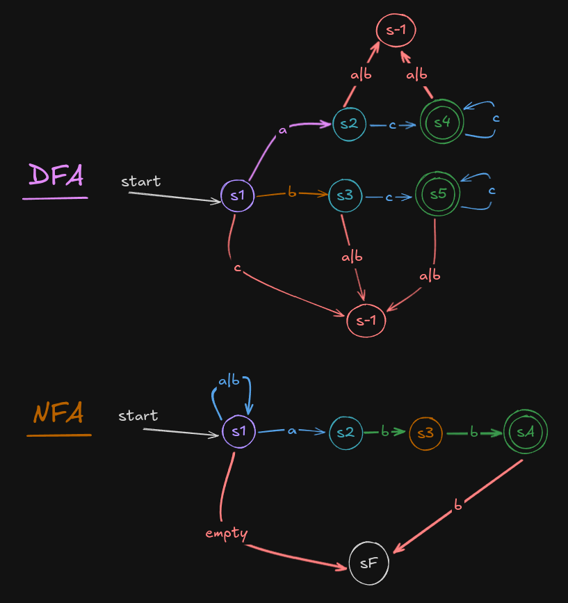

# Finite State Machine Project

This project implements a Finite State Machine

The language for the DFA is: (a+b)c\*

Some examples of acceptable input are: ac, bc, acc, bcc, accc, bccc, etc.

The language for the NFA is: (a | b)\*abb
Some examples of acceptable input are: aabb, babb, aaabb, bbabb, ababb, etc.

Layout:

